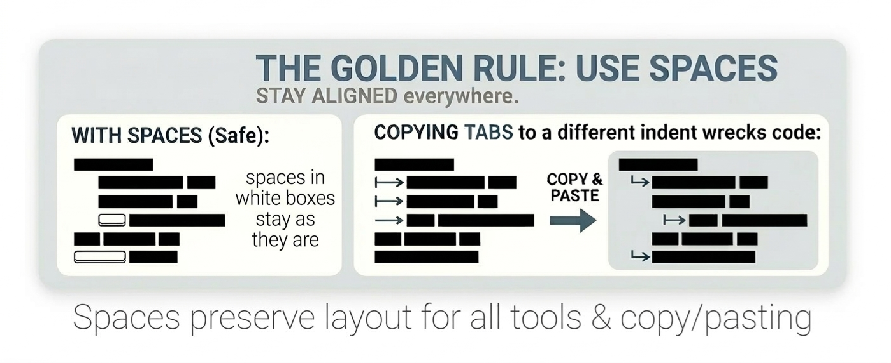

<!--

Link: https://is.gd/bGeOoE

https://github.com/jaalto/project--shell-script-performance-and-portability/blob/master/SHELL-SCRIPT-CODING-STYLE.md

INFORMATION FOR EDITING

- Github Markdown Guide:
  https://is.gd/nqSonp

- View markdown in VSCode:
  Command Palette (C-S-p)
  Markdown: Open Preview C-S-v
  Markdown: Open Preview to the side C-k v
  [upper right:eye-icon button] Open Preview to the Side

- URL text fragments: #:~:text=
  https://developer.mozilla.org/en-US/docs/Web/URI/Reference/Fragment/Text_fragments

- About accessibility

  To support viewing and editing GitHub
  pages on phone displays, the maximum
  column widths are described below.
  Exception: The GNU License at the end
  of file is included verbatim.

  The maximum column limits are:

  col type
  --- -------------------------
  31  Code: bullet: ``` ... ``´)
  40  Regular text and paragraphs.
      Github line limit to support
      editing.
  --- ----------------------------------

  Emacs editor settings:

  ;; eval code with C-x C-e
  (progn
    (setq fill-column 40)
    (display-fill-column-indicator-mode 1))

MISCELLANEOUS

- To search POSIX.1-2024 in Google
  site:pubs.opengroup.org inurl:9799919799 <search>

FORMAT

- Rule
- Rationale
- Discussion that serves as the philosophical
  deep dive to support Rationale.

-->


# SHELL SCRIPT STYLE GUIDE

## 1.0 Foundations and Standards

### 1.1 Context

This guide is designed for developers
targeting modern most POSIX compliant
`/bin/sh` environments, including Linux,
macOS, BSD systems using the [ksh93]
shell, Windows Subsystem for Linux
([WSL]), Windows [Cygwin] and Windows
[MSYS2].

It does not target legacy UNIX systems or
ancient Bourne shells. If the project
requires compatibility with systems older
than 15 years, please consult the [GNU
Autoconf/Portable Shell Programming]
manual instead.

### 1.2 Design Philosophy

Use [POSIX] conventions where possible
to improve portability.

Use conventions that maximize simplicity
and clarity. Embrace minimalism in the
spirit of the [Less Is More] philosophy
(LIM), similar to [Keep It Short and
Simple] (KISS).

Prioritize minimum effort over
rigorous standards for small
controlled scripts. For example, the
inclusion of a Help() or the
requirement to start logic within
Main() is not necessary for
non-production, or small, scripts.

When sharing code intended for a
wider audience, or for deployment in
a production or operational
environment, adhere to best
practices, like variable quoting, to
prevent unexpected behavior.

### 1.3 Tooling

Use [ShellCheck] or other [linting]
tools to improve code quality.

**Rationale:** programs are prone to
subtle syntax errors—such as improper
quoting or word splitting—that often go
unnoticed during development. Specific
tools provide help ensuring
best practices.

### 1.4 Environment and Dependencies

**A. Dependencies**

Use GNU tooling and require their
installation in the project's README.

**Rationale:** GNU utilities are more
capable and generally optimized for speed
compared to their minimal POSIX
counterparts. They also provide
standardized behavior across different
operating systems (Linux, macOS, BSD),
ensuring improved interoperability.
See [GNU coreutils], [GNU findutils],
[GNU diffutils] [GNU grep], [GNU sed],
[GNU awk] etc.

**B. Long options**

Use readable `--long` form options in
calling utilities (e.g. `grep`) where
possible.

**Rationale:** `--long` options make a
command's intent clear, making it easier
to read and maintain in the long term.
Long options act as self-documenting
code, whereas short options frequently
require consulting man pages to
understand their meaning.

### 1.5 Code Organization

Use best practices by dividing the
program into logical sections to improve
scannability and structure. This
structure ensures that dependencies
(functions and constants) are defined
before they are executed.

- The Comment Block: Script description,
  usage, and dependencies.
- Constants: Global variables.
- Functions: Modular logic blocks.
- Main: program entry point at the bottom of
  the file.

An example:

```shell
    #! /bin/sh
    #  <comment block>

    GLOBAL_VAR="value"

    # Function definitions
    Help ()
    {
         # Display help
         exit 0
    }

    Main ()
    {
        Help # Main controller
    }

    Main "$@" # Send command line args

    # End of file
```

**Rationale:** Relying on functions is a
core design principle that modularizes
logic from the outset. It ensures
variable localization, encourages
thinking in discrete execution blocks,
and keeps code segments concise and
visible. This 'one-task-per-function'
makes the program easier to extend and
maintain as it evolves.

## 2.0 Structure and Layout

### 2.1 POSIX sh Shebang Line

Use `/bin/sh` in the first line, the
[shebang] line.

``` bash
  #! /bin/sh
```

**Rationale:** The shebang is the de
facto standard that ensures portability
across POSIX-compliant systems. The
system's POSIX-compliant shell
implementation is located at `/bin/sh`.

Note: To improve readability, add a
single space after the [shebang] and
before the interpreter path.

### 2.2 Project Metadata

Use global variables defined at the top
of the script to specify project metadata
for immediate visibility. These variables
should provide essential context, such as
versioning or author information, for
both users and automated tools.

``` shell
    PROGRAM=${0##*/}
    VERSION="YYYY.mmdd.HHMM"

    AUTHOR="John doe <jdoe@example.com>"
    URL="http://example.com/homepage"
    LICENSE="GPL-3.0-or-later"
```

**Rationale:** Centralizing metadata at
the beginning of the file ensures that
key information is easily discoverable
without searching through the logic. This
practice also simplifies maintenance and
allows external scripts or build systems
to parse script information consistently.

Notes:

- Licensing: Use the
  [SPDX License List] short-identifiers,
  like [GPL-3.0-or-later],
  [ISC], [MIT] or [BSD-2-Clause].
- Versioning: Use a machine-readable
  format (N.N[.N]). Follow
  [Semantic Versioning] for production,
  or use dotted date-based versioning (e.g.,
  YYYY.mmdd\[.HHMM\]) for small projects to
  provide immediate context regarding the
  script's age compared to an arbitrary
  version like 1.5.0.

### 2.3 File Header and License

Use a top-level comment block to
document the script’s purpose and
licensing. This block should include
a:

- **Copyright:** add Copyright holder.
- **License:** add
  standard license text.
- **Description:** Optional if
  included in `--help`.
  Describe script's functionality.
- **Usage:** Optional if included
  in `--help`. Provide clear examples of
  how to invoke the command.
- **Dependencies:** List required
  external requirements.

An example. Add the license text
according to the instructions provided
by the issuer; for example, for the
GNU GPL
https://www.gnu.org/licenses/gpl-howto.en.html

``` shell
    #! /bin/sh
    #
    #   <file> -- <description>
    #
    #   Copyright
    #
    #       Copyright (C) YYYY Firstname Lastname <email>
    #
    #   License
    #
    #       This program is free software; you can redistribute it and/or
    #       modify it under the terms of the GNU General Public License as
    #       published by the Free Software Foundation; either version 3 of the
    #       License, or (at your option) any later version
    #
    #       This program is distributed in the hope that it will be useful, but
    #       WITHOUT ANY WARRANTY; without even the implied warranty of
    #       MERCHANTABILITY or FITNESS FOR A PARTICULAR PURPOSE. See the GNU
    #       General Public License for more details.
    #
    #       You should have received a copy of the GNU General Public License
    #       along with program; see the file COPYING. If not, write to the
    #       Free Software Foundation, Inc., 51 Franklin Street, Fifth Floor,
    #       Boston, MA 02110-1301, USA.
    #
    #       Visit <http://www.gnu.org/copyleft/gpl.html>
    #
    #   Usage
    #
    #       See the --help option.
    #
    #   Dependecies
    #
    #       GNU utilities: grep, awk etc.
```

TABLE: Major *Conditional* Free Software and Open Source Licenses

License Type | Compatibility | Type | Legal Impact
:---         | :---          | :--- | :---
Permissive: [ISC] (preferrable), [MIT], [BSD-2-clause] | High | FSF/OSI approved | For Code. **Pros:** Minimal restrictions; allows broad integration and proprietary redistribution. Code can be incorporated into closed-source commercial products. **Cons:** Downstream modifications may be kept private, potentially limiting community contributions.
Weak Copyleft: [LGPL]     | Medium | FSF/OSI approved | For libraries. **Pros:** Allows linking with proprietary software while ensuring the library itself remains open. **Cons:** Requires library-specific modifications to be released under the same license.
Strong Copyleft: [GPL] v3  | Restricted; license mixing it with proprietary code | FSF/OSI approved | For Code. **Pros:** Ensures code remains "forever free"; prevents the software from becoming closed-source. **Cons:** "Viral" nature requires derivative works to be licensed under the same GPL terms. Commercial use is allowed, but source code for all distributed modifications must be available.

**Why these are good for software :** The are universally understood and tested licenses.

TABLE: Major *Unconditional* Public Domain Dedication Licenses

License Type | Compatibility | Type | Complexity | Legal Impact
:---         | :---          | :--- | :--- | :---
[0BSD] aka Zero-BSD  | High | FSF approved (but not recommended) / OSI approved | Low (Single paragraph; grant type) | Professional. Uses standard contract law as it it essentially the ISC License with the requirement to include the copyright notice removed. Carries the standard warranty disclaimers that protect developer from liability. OSI considers 0BSD a real license with proper legal terminology.
[Unlicense] | High | FSF approved / OSI approved (but with reservations) | High (Multi-paragraph; waiver type)| Problem: "Vagueness" in some jurisdictions. While approved, OSI considers its "dedication" approach legally sloppy for software and the whole idea of trying to use "Public Domain" a mess because it doesn't exist in many countries (like Germany).

**Why these are good for code snippets:** No attribution or "notice" requirement. Developers can copy-paste code directly into any project (proprietary or open) without carrying over license files or copyright headers.  The user has no obligation to mention creator's name or include the license file in their distribution.

**DISCUSSION**

The proliferation of licenses is a major
problem in the open-source ecosystem. To
ensure that code and components can be
combined seamlessly within a project, it
is preferable to standardize on major
licenses that are both [FSF] (Free
Software Foundation) and [OSI] (Open
Source Initiative) compliant.

**The Problem of License
Incompatibility**: The primary issue is
that differing licenses may prohibit the
combining and sharing of code. License
incompatibility occurs when the terms of
two different licenses contradict each
other, making it legally impossible to
distribute a work that incorporates code
from both sources. This license
fragmentation results in legal barriers
that hinder collaborative innovation and
the reuse of existing work.

**About the ISC:** Why is [ISC] often
considered preferable over MIT and BSD?
The ISC license is functionally
identical to the MIT and Simplified BSD
licenses but excels in legal brevity:
ISC is approx. 100 words, whereas MIT is
approx. 170. While established, the MIT
license contains language specific to
the Massachusetts Institute of
Technology’s 1980s policies. It includes
a specific grant for "sublicensing" that
many legal scholars argue is redundant
if the license already allows users to
"deal in the software without
restriction." The Internet Systems
Consortium (ISC) removed this and other
unnecessary wording made redundant by
the global adoption of the Berne
Convention. **Bottom Line:** ISC is
essentially a stripped-down, modern
refinement of the MIT and BSD-2-Clause
licenses.

**About 0BSD:** The FSF considers 0BSD a
Free Software license; however, they do
not recommend or formally approve it for
general use. While 0BSD is legally
valid, the FSF prefers classic licenses
like the GPL or ISC to avoid "license
sprawl," which can complicate compliance
for large projects. Using established
licenses ensures that copyright notices
remain intact, preserving the software's
history and clearly communicating rights
to future developers. Furthermore, the
FSF favors the Unlicense over 0BSD
because they generally dislike licenses
that allow for the removal of copyright
notices. **Bottom Line:** Despite the
FSF's philosophical stance, 0BSD is
built on a solid ISC legal foundation
and is likely more defensible across all
jurisdictions than "waiver-based"
alternatives like the Unlicense.

**About Unlicense:** The FSF prefers the
Unlicense over 0BSD for two primary
reasons. The first is moral: the FSF
views the Unlicense as a bold statement
of "Freedom." By explicitly "dedicating
to the public domain," it represents a
clearer ideological choice for
developers seeking to waive copyright
entirely. The second is practical: it
includes a more prominent No-Warranty
disclaimer compared to the minimalist
phrasing in 0BSD. **Bottom Line:**
Despite its "moral" stance, its
waiver-based approach is often more
difficult to uphold legally than the
"grant-based" approach of 0BSD.

TABLE: Problematic licenses to avoid

License      | Status    | Problems
:---         | :---      | :---
CC0-1.0      | avoid     | Creative Commons licenses are not designed for software. While endorsed by the FSF (with caveats), CC0 is rejected by the OSI for code. Possible use cases: Non-code assets (documentation, images) and minimal code snippets.
[WTFPL], [WTFNMFPL], [GLWTPL] etc. | avoid at all costs | These aren't just "informal"—they are considered toxic. While they are funny in a "hacker culture" way, they are the digital equivalent of a "Keep Out" sign written in crayon: they have zero legal weight and create massive headaches for anyone trying to use any  code in a corporate or serious environment. They do not have proper and robust liability waivers to protect you from being sued. Most corporate legal departments (Microsoft, Google, Oracle, Red Hat) have blacklisted them for a reason. They even have automated scanners that auto-reject these licenses.

**About CC0:** It is primarily designed
for "works of creativity" (images,
music, prose). While approved by the FSF
for its "three-tiered" legal safety net
(Public Domain dedication, fallback
license, and non-assertion covenant),
CC0 is disapproved by the OSI for
software. It lacks specific definitions
for binaries vs. source code and
explicitly excludes patent grants,
creating a potential legal trap.
Furthermore, its liability disclaimer is
lacking. **Bottom Line:** Suitable for
documentation and assets. For "Public
Domain-like" code, [0BSD] is more
professional choice; it is written for
software and approved by both the FSF
and OSI.

### 2.4 Execution Flow and Main

Use a function named `Main` to
encapsulate the entry logic of the
script, and place it as the bottom-most
function to ensure the program's starting
point is easily identifiable.

```shell
    Main ()
    {
        local arg
        arg="${1:-}"

        echo "1st command line arg: $arg"
    }

    Main "$@"
```

**Rationale:** Main provides consistency
with other programming languages,
allowing readers to find the start of
the program quickly and intuitively. The
formal entry point provides a clear
starting location for execution and
prevents global variables from
cluttering the namespace. This
separation allows individual functions
to be tested in isolation without
triggering the primary application
logic.

TABLE: Programming languages and their entry points

Language | Entry Point | Comment
-------- | ---         | ---
C        | main()      | mandatory
C++      | main()      | mandatory
Objective-C | main()   | mandatory
C#       | main()      | (mandatory)
D        | main()      | mandatory
Java     | Main()      | mandatory
Kotlin   | main()      | mandatory
Scala    | main()      | mandatory
Rust     | main()      | mandatory
Zig      | main()      | mandatory
Go       | main()      | mandatory
Haskell  | main()      | mandatory
Python   | main()      | customary \_\_main\_\_, best practices
Perl     | main()      | customary, best practices
Ruby     | main()      | customary \_\_FILE\_\_, best practices
Javascript| await ... main() | customary, best practices
Swift    | @main, main.swift | customary, best practices
PowerShell | Main     | customary, best practices
PHP      | main() for CLI | customary, best practices

See list of popular programing
laguages at [PLrank] (most accurate),
[PLrankings] and [TIOBE index] (search
results based, the least objective).

### 2.5 User Interface and Help

Provide a `Help()` function near the
top of the file for quick reference.
Use a standard set of options to
ensure a uniform user interface. At a
minimum, the `-h` (help) option must
be implemented.

**Rationale:** User expectations are best
met by providing a standardized
interface.

TABLE: suggested standard options

Option| Long Option |Description
:---  | :---        | :---
-h    | --help      |Display usage instructions and exit
-v    | --verbose   |Increase output detail for monitoring.
-V    | --version   |Print version information and exit.
-D    | --debug     |(Optional) Enable tracing output.

TABLE: other common option names

Option| Long Option |Description
:---       | :---        | :---
-c FILE    | --config    |Configuration file
-d DIR     | --dir       |Directory
-f FILE    | --file      |file
-t         | --test, --dry-run |Run in test mode (also -n, --no-op)

An example code for option handling.
Note that the POSIX [getopts] utility is
not used here as it does not natively
support readable long options. A minor
limitation of this pattern is that it
does not support stacked short options
(e.g., accepting `-lx` for `-l -x`).
Mentioning this in the BUGS section of
the Help() page will manage user
expectations and provide transparency
regarding the script's CLI limitations.

``` shell
    PROGRAM=${0##*/}

    Help ()
    {
        # See sections and formatting
        # ideas in the manual pages.

        echo "\
    SYNOPSIS
        $PROGRAM [options]

    OPTIONS
        -f, --file FILE
            Use FILE.

        -t, --test, --dry-run
            Run in test mode.

        -D, --debug
            Turn on debug.

        -v, --version
            Display version and exit.

        -v, --verbose
            Display verbose message.

        -h, --help
            Display help and exit.

    DESCRIPTION
        <...>

    FILES
        <...>

    ENVIRONMENT
        <...>

    BUGS
        Short options cannot be stacked:
        Options must be provided
        separately (e.g., -v -t) rather
        than combined (e.g., -vt).

    AUTHOR
        <...>

    LICENSE
        <...>
    "
        exit 0
    }

    Warn ()
    {
        echo "$*" >&2
    }

    Die ()
    {
        Warn "$*"
        exit 1
    }

    Verbose ()
    {
        [ "${VERBOSE:-}" ] || return 0
        echo "$*"
    }

    Debug ()
    {
        [ "${DEBUG:-}" ] || return 0

        # Eval for complex commands, like
        # Debug "echo 'this $message' > file"

        eval "$@" >&2
    }

    Main ()
    {
       while :
       do
            local opt
            opt="${1:-none}"

            case $opt in
                -f | --file)
                    shift
                    FILE="${1:-}"
                    if [ ! -f "$FILE" ]; then
                        Die "ERROR: No --file '$FILE'"
                    fi
                    shift
                    ;;
                -v | --verbose)
                    shift
                    VERBOSE="verbose"
                    ;;
                -V | --version)
                    shift
                    # Calls exit 0
                    Version
                    ;;
                -D | --debug)
                    shift
                    DEBUG="debug"
                    ;;
                -t | --test | --dry-run)
                    shift
                    TEST="test"
                    ;;
                -h | --help)
                    shift
                    # Calls exit 0
                    Help
                    ;;
                --) # End of options
                    shift
                    break
                    ;;
                -*)
                    shift
                    Warn "WARN: unknown option: $opt"
                    ;;
                *)
                    break
                    ;;
            esac
        done

        Verbose "Program started"
        Debug echo "Debug is on"
    }

    Main "$@"
```

## 3.0 Style and Naming

### 3.1 Style Considerations

Programs can be written in various
styles. To ensure scripts are readable
and maintainable, adopt a consistent
naming and layout convention throughout
the project.

Commonly used layout styles include
[K&R] (same-line braces) and [Allman]
(new-line braces). For identifiers,
There is either [Snake case] (e.g.,
`my_variable`) or [Camel case] (e.g.,
`myVariable`). Maintain a uniform
indentation strategy and ensure
consistent spacing between statements
(loops and conditionals are separated
by newlines).

This style guide adopts the following
conventions explained below.

**Discussion:** Tabs vs. Spaces.

While Tabs allow for personal display
preferences in local editors, they
often create a "false sense of line
length." Because tab widths vary
across environments (e.g., 2 vs. 8
spaces), code that fits on one screen
may overflow and become unreadable on
another.

Conversely, fixed spaces ensure the
"shape" of the logic remains identical
across all environments. Tabs cause
the structure to shift based on local
settings, whereas spaces maintain
absolute consistency. Providing
individual control over tab width is
considered secondary to maintaining a
predictable codebase across automated
tooling, git diffs, and version
control systems.

The system-wide predictability is
prioritized over individual
preference.

### 3.2 Line Length

Use a maximum line length of 80
characters.


**Rationale**

This limit is a deliberate constraint
based on human physiology and complexity
management. Human eyes scan vertical
text much faster than horizontal text
(C.f. newspaper columns and
speed-reading). In coding, a 10-word
line (approximately 7 characters wide)
is kept within the 80-column boundary,
which is considered scientifically
optimal for human anatomy.

With limited space, complex logic must
be broken out, or refactored into more
manageable parts. Less code per line is
better than more.

### 3.3 Indentation

Use 4 spaces for indentation.

**Rationale:** No TABs. With spaces
the layout remains uniform across
editors, terminals, and tools like
[diff], where TAB widths vary.
Additionally, copy-pasting code
preserves the exact formatting. Refer
to 3.1



Unlike spaces, a Tab is not defined
by a fixed width; it is treated as an
instruction for the "next tab stop"
to be jumped to. When code containing
Tabs is copied and pasted into a
location where a different
indentation level or Tab-width
setting is used, the alignment is
broken. As is shown in the final box,
the lines are "drifted."

### 3.4 Naming Conventions

**Functions:** Use [CamelCase] for
functions starting with an uppercase
letter (e.g., `IsNumber`).
**Rationale:** Uppercase function
names minimize conflicts with existing
lowercase utility commands.

**Local Variables:** Use [camelCase]
for variables. Start with a lowercase
letter (e.g., `maxLength`).
**Rationale:** Less visual noise
compared to [Snake Case], underscore
characters `in_variable_names`.

**Global Variables:** Use uppercase
for global variables outside of
functions. **Rationale**: Using
UPPERCASE is a widely adopted standard
across programming languages to denote
constants or global state. In shell
scripting, it mirrors the convention
for system environment variables, such
as $PATH and $HOME.

Examples:

``` shell
    # Global variables in ALL_UPPERCASE
    URL_HOMEPAGE="http://example.com"

    # Preferred
    thisResult=$(usesVar + andAnother)

    # Avoid
    this_result=$(uses_var + and_another)

    Sort () # initial Uppercase, not sort()
    {
        ...
    }
```

### 3.5 Visual Layout (Allman style)

Use primarily the top-down [Allman] style
for functions and control structures.

```
do        {         case     if then
.         .         .        .
.         .         .        .
done      }         esac     fi
```

**Rationale:** To maximize clarity,
placing block-defining braces on
their own lines makes boundaries
visually distinct and significantly
improves scannability.

**Discussion:** While the [K&R]
(Kernighan & Ritchie) style is more
compact, the [Allman] style is
adopted for its focus on structural
clarity and vertical alignment. This
approach prioritizes the ease of
scanning nested blocks; by placing
the opening and closing braces in
the same column, the code block
forms a clear, symmetrical "box."
This symmetry allows the eye to
quickly identify the scope of a
logical block without searching for
trailing characters.

# 4.0 Error Handling

## 4.1 Execution Safety

At the beginning of file, explicitly
set shell options for early exit and
error checking. Use variations of the
[unofficial bash strict mode]. For
robustness, include at least the first
two options.

``` shell
    #! /bin/sh

    # Use readable long options
    # instead of 'set -eu'

    # Recommended
    # - Exit on error
    # - unused vars
    set -o errexit
    set -o nounset

    # Optional
    # - fail on $()
    # - fail cmd on pipe
    set -o errtrace
    set -o pipefail
```

**Rationale:** The minimum settings
(*errexit, nounset*) treat errors and
unset variables as fatal, preventing
unexpected behavior. Be sure to also
learn their caveats from [Bash FAQ/105]
and [Bash Pitfalls/60].

**Discussion**

While there are some reservations
regarding the use of `set -o errexit`
and `set -o nounset`—primarily centered
on the potential for "false security"
and inconsistent behavior in complex
subshells—the structural benefits
generally outweigh the caveats. The
primary risk of these flags is not that
they fail, but that a developer might
assume they replace the need for robust
logic. However, in the vast majority of
production scenarios, a script that
terminates abruptly is far safer than
one that continues to execute with
undefined variables or failed
prerequisites.

The decision to use these flags should
be viewed as a choice between *fail-fast*
automation and *manual* error management.
For most modern workflows, the safety
net provided by these options prevents
"silent failures" that are often the
root cause of data loss or system
misconfiguration.

The other benefit of enabling these
flags is that less code is needed to
read and maintain in the spirit of
[Less Is More].

The following code is simple; the script
will exit immediately if the directory
does not exist or if `$extension` has
been misspelled (e.g., if the variable
was defined as `$ext` but called as
`$extension`).

```shell
    # Preferred.
    #! /bin/sh
    set -o errexit
    set -o nounset

    ...
    cd "$dir"
    rm ./*"$extension"
```

Without `set -o ...` settings, extra
check statements are required. A more
significant danger is that the `rm`
command will silently execute even if
the variable name was misspelled (e.g.,
if the variable was defined as `$ext`).

```shell
    #! /bin/sh
    ...
    cd "$dir" || exit "$?"
    rm ./*"$extension"
```

## 4.2 Explicit Error Checking

Check status of commands and
exit early. Use the
standard special parameter
[$?](https://www.gnu.org/software/bash/manual/bash.html#index-_003f)
to retrieve exit status of the most
recently executed command.

``` shell
    if ! echo "$*" | grep -qe "--dir" ; then
        echo "ERROR: no option --dir" >&2
        exit 1
    fi

    ...
    cd "$dir"

    if ! git status ; then
        echo "FATAL: no Git dir (error $?)" >&2
        exit 1
    fi
```

## 4.3 Exit Status

**Set a exit status:** Scripts
should exit with 0 for success and a
non-zero value to indicate a failure
or specific error condition.

```
    <...code...>
    exit 0 # success
```

# 5.0 Temporary Files

## 5.1 Using mktemp

Use safe temporary files and
directories with [mktemp].

``` shell
    TMPBASE="${TMPDIR:-/tmp}/${LOGNAME:-${USER:-dummy}}.tmp.$$"

    tmpfile="$(mktemp -t "$TMPBASE.XXXXX")"
    tmpdir="$(mktemp -d -t "$TMPBASE.XXXXX)"
```

**Rationale:** Prevent symlink attacks
and race conditions in multi-user
environments. See [Bash FAQ/062].

**Discussion:** The `mktemp` utility is
not part of the POSIX standard. It
originated in BSD and was later enhanced
in [GNU coreutils]. For maximum
portability across Linux, BSD, and
macOS, always use the `-t` option and
provide a template.

## 5.2 Using trap
Use a [trap] to ensure proper cleanup
of temporary files on script exit.
See [Bash Guide/SignalTrap].

``` shell

    AtExit ()
    {
        # Capture trigger status.
        ret=$?

        # Calling 'exit' is safe here as
        # the EXIT trap is internally
        # disabled during  execution.

        [ "${TMPBASE:-}" ] || exit "$ret"

        rm -rf "$TMPBASE"* # see 5.1
        exit "$ret"
    }

    trap 'AtExit' EXIT HUP INT QUIT TERM
```

# 6.0 Variables

## 6.1 Global Variables

Global Variables: Use `ALL_CAPS` for
global, environmental, or read-only
constants.

## 6.2 Quote Variables

Use `"$quoted"` variables.

## 6.3 Variable "$@"

Use `"$@"`, that is, quote the "all
arguments" [special parameters]
variable. This is mandatory to keep
each argument distinct and uncorrupted.

```
    # Set positional parameters
    set -- 1 2 3

    for item in "$@"
    do
        echo "$item"
    done
```

**Rationale:** The quoted form "$@"
ensures that each positional parameter
is passed as a separate, distinct
string. This is critical for handling
arguments that contain spaces, tabs, or
newlines.

Without quotes, the shell performs Word
Splitting and Globbing on the arguments.
This causes a single argument like "New
Folder" to be split into two separate
arguments ("New" and "Folder"), often
leading to script failure or data
corruption.

See [Bash Pitfalls/24], [Bash Sheet]
and shellcheck [SC2086]

## 6.4 Simple Variable Expansion

Use simple `$var` by default. Use
the braces only when necessary for
boundary conditions (e.g.,
`${var}suffix`) or when utilizing shell
[parameter expansion] (e.g.,
`${var:-default}`).

``` shell
    path="$dir/$to/$file"

    # Avoid
    path="${dir}/${to}/${file}"
```

**Rationale:** Minimalism in the spirit
of [Less Is More]. Simple expansions
allow the developer to identify variables
at a glance without extra punctuation. In
genral, the fewer characters there are to
scan, the faster and more readable the
line is. In cognitive psychology, this is
often referred to as reducing
[Cognitive Load] minimizing the mental
effort required for a developer to
understand, maintain, and modify code.
One of the Clean Code rules of thumb is:
remove anything that might distract the
reader.

**Discussion**: Modern engineering often
requires jumping between disparate
codebases, each with its own unique
patterns, naming conventions, and mental
models. This constant context switching
is computationally expensive for the
human brain; every shift requires
reloading an entirely different set of
assumptions.

Style  | Example          | Cognitive Effort
:---   | :---             | :---
Simple | \$dir/\$file     | Low (Instant recognition)
Braced | \${dir}/\${file} | Medium (Braces must be checked for expansion logic)

## 6.5 Variables and Truth Tests

Use simple truth tests for boolean
variable checks. Omit explicit `-n`
(non-zero length) or `-z` (zero length)
options. Always wrap the variable in
double quotes.

**Rationale:** [Less is More]. For
programmers coming from C, C++, [Python],
[Perl], or [GNU Awk], simple truth tests
are intuitive and familiar. In shell,
explicit options don't add functional
value when values are in double-quotes.
Minimizing extra options reduces also
shell-specific Cognitive Load when
switching from one language to another.

``` bash
    # Preferred
    [ "$var" ]    # Has value
    [ ! "$var" ]  # No value

    # Avoid
    [ -n "$var" ]
    [ -z "$var" ]
```

**Discussion**: Examples of programming
languages that allow simple boolean
tests, where a variable can be evaluated
directly without an explicit comparison
operator (e.g., `if (x)` instead of `if
(x != 0)`).

TABLE: lanaguages and simple truth tests

Language    |  Syntax example         | Truthiness logic |
:---        | :---                    | :---
C           |  if (var) { ... }       | 0 is false; any non-zero is true. |
C++         |  if (var) { ... }       | Handles pointers and numerics as C. |
Python      |  if var:                | None, 0, and empty collections are false. |
JavaScript  |  if (var) { ... }       | 0, "", null, undefined, and NaN are false. |
PHP         |  if ($var) { ... }      | Similar to JS; "0" (string) is also false. |
Perl        |  if ($var) { ... }      | 0, '0', "", and undef are false. |
Objective-C |  if (var) { ... }       | nil and 0 are false. |
Swift       |  if let x = var { ... } | Apple iOS (mobile). Used specifically to test for non-nil. |

Notes: Languages like Java, C#, Ruby, and
Rust are excluded from the list because
they require an explicit boolean
expression. In those languages, `if (x)`
will fail to compile if `x` is an integer
or a pointer/reference or similar.

# 7.0 Formatting and Syntax

## 7.1 Logical Grouping

Use blank lines between logical blocks
and groups if code to improve
readability.

**Rationale:** In the spirit of [Less is
More], white space is not empty; it is a
tool to improve scannability. Just as
paragraphs break up a story, blank lines
group related commands together, allowing
the reader to process the code more
easily.

```shell
    # Preferred
    list="1 2 3"

    for i in $list
    do
        item=$$((i + 1))

        if [...]; then
            ...
        fi
    done

    # Avoid tight code
    list="1 2 3"
    for i in $list
    do
        item=$$((i + 1))
        if [...]; then
            ...
        fi
    done
```

## 7.2 Loops

Use the [Allman] "line up" style in
`do..done`.

``` shell
    for item in 1 2 3
    do
        ...
    done

    while :
    do
        ...
    done
```

## 7.3 Conditional Statements

Use [K&R] style for placing `then`
keyword provided that `<statement>` is
short and simple enough.

``` shell
    if <statement>; then
        ...
    fi
```

In longer statements, switch to the
full [Allman] style for better clarity. The
command becomes more visually prominent
and stands out better compared to keeping
the `; then` on the same line.

```shell
    if <this is an example of a very long command statement>
    then
        ...
    fi
```

## 7.4 Case Statements

Place pattern case terminators `;;` in
their own lines.

``` shell
    # Preferred
    case $var in
        pattern1)
            ...
            ;;
        pattern2)
            ...
            ;;
    esac

    # Avoid
    case $var in
        one) ... ;;
        pattern2 | more) ... ;;
    esac
```

**Rationale:** Improves the visual flow
and make the action blocks stand out.

**Note:** POSIX case require no quotes for
`$var` because it does not undergo word
splitting or globbing.

# 8.0 Input/Output and File Handling

## 8.1 Errors to Stderr

Send error messages to stderr. Put
stderr redirection `>&2` at the end of line.

``` bash
    # Preferred
    echo "Normal output to stdout"
    echo "ERROR: message to stderr" >&2

    # Avoid
    echo >&2 "ERROR: message to stderr"
```

**Rationale:** To ensure the message
remains the primary argument. Standard
redirections (like `> file` or `>&2`)
are traditionally appended to the end of
the line, making the script easier to
scan.

## 8.2 Help to Stdout

Display help to stdout and exit with status 0.

``` bash
    arg="${1:-}"

    if [ "$arg" = "-h" ]; then
        echo "Synopsis: ...."
        exit 0
    fi
```

**Rationale**: Displaying help, program
version etc. are not error conditions.

## 8.3 Reading Input

Always use [read] with option `-r`.

``` bash
    while read -r item
    do
        ...
    done < file
```

**Rationale:** When reading input with
read, always use the `-r` option to
prevent backslash interpretation, which
can lead to unexpected behavior. See
[Bash FAQ/001] and
shellcheck [SC2162].

## 8.4 Command Substitution

Use POSIX `$(command)`
instead of archaic \`backticks\` for
[Command Substitution].

``` bash
    # Preferred
    dirname="$(basename "$(pwd)")"

    # Avoid
    dirname=`basename \`pwd\``
```

**Rationale:** The POSIX Command
Substitution syntax has been
supported in shells for well over 15
years. Even legacy systems now almost
universally provide a default shell
compatible with this standard. It is
more readable and allows for cleaner
nesting. A side note: on many non-US
keyboard layouts (such as German,
French, or Nordic), the backtick is
an inconveniently located dead key,
or access to it requires a complex
modifier combination (AltGr).

See also [Bash FAQ/082] and shellcheck
[SC2006].

# 9.0 Functions and Scope

## 9.1 Function syntax

Use the standard POSIX parentheses syntax
to define functions. Avoid the
non-standard `function` keyword.

``` shell
   # Preferred. Standard POSIX syntax.
   Example ()
   {
        # Body
   }

   # Avoid
   function Example ()
   {
        # Non-POSIX: Bash, Zsh syntax
   }

    # Call command
    Example "arg"
```

**Note:** Shell scripts define commands
rather than traditional programming
language functions. Prefer defining
function names using leading Uppercase
letters to minimize conflicts with
existing lowercase utility commands
(consider: system `sort` vs your `Sort`,
etc.)

**Stylistic Note:** Prefer including a
space before the function parentheses to
align with the output of the Bash [type]
command. In shell scripting, functions
act as internal commands rather than
traditional programming subroutines.
Since the parentheses `()` are merely
syntax markers and are not used for
passing arguments, the `Example ()`
notation reinforces that commands are
being deined (cf. call: `Example arg`).
This distinction helps to deter the
assumption that arguments should be
defined within the parentheses.

## 9.2 Function Local Variables

Use `local` command to define variables in
functions.

``` shell
    Example ()
    {
        local dummy

        # Add visible cues.
        # Seen during debug: set -x
        dummy="debug: check config"
        ...

        dummy="debug: check ENABLE"
        ...
}
```

**Rationale:** Using the `local` command
prevents variable leakage into the
global scope. This practice promotes
encapsulation and modularity, making
scripts easier to debug and maintain.

**Discussion**

The `local` command
isn't defined in the [POSIX] standard,
but it is 99% supported by all the
best-effort POSIX-compatible `sh`
shells. The `local` keyword is portable
enough to be used in modern shell
scripts.

Shell | local supported
:---  | :---
posh  | yes
dash  | yes
busybox ash 1.37.0 | yes
mksh  | yes
ksh 93u+m/1.0.10 2024-08-01 | no (typeset keyword)
bash  | yes
bash --posix 3.2 | yes (macOS /bin/sh)
zsh   | yes

**Note about Dynamic Scope**

The shell uses dynamic scoping to
control a variable’s visibility within
functions. See the [functions] section
in Bash manual. This means that a
function can see variables defined not
just inside its own scope, but also
variables defined by any other function
that called it.

Recommendation: Avoid relying on dynamic
scoping; functions should be decoupled
according to industry best practices.
Instead, pass necessary data explicitly
via arguments to ensure each function
remains a self-contained unit.

``` shell
    # Preferred
    Two ()
    {
        local arg
        arg="${1:-}"

        echo "$arg"
    }

    One ()
    {
        local var
        var="hello"

        Two "$var"   # Send args
    }

    One

    # - - - - - - - - - - - - - - -
    # Avoid

    Two ()
    {
        echo "$var" # "hello"
    }

    One ()
    {
        local var
        var="hello"

        Two # relies on dynamic scoping
    }

    One
```

## 9.3 Function Local Variables in Ksh

If supporting BSD or UNIX systems that
may use [ksh] as `/bin/sh` is required,
include the necessary code at the
script's start to emulate the `local`
keyword.

``` shell
    IsCommand ()
    {
        [ "${1:-}" ] || return 1
        command -v "${1:-}" > /dev/null 2>&1
    }

    if ! IsCommand local; then
        if IsCommand typeset; then
            # Use 'eval' to hide
            # statement. Would otherwise
            # cause program to exit due
            # to parse error at 'local'.

            eval 'local () { typeset "$@"; }'
        fi
    fi

    PortableLocal ()
    {
        # Portable use of local.
        # On their own lines:
        # - Declaration
        # - Assignment

        local var
        var="value"
    }
```

## 9.4 Function Argument Handling

Use meaningful local variables for
function arguments. In longer functions,
prefer assigning positional arguments
(`$1`, `$2`, etc.) immediately to local
variables.

``` shell
    Example ()
    {
        local file
        file="${1:-}"
    }
```

**Rationale:** Improves code readability
and makes the logic within the function
easier to follow and maintain.

# 10.0 Other

## 10.1 echo vs printf

Use POSIX [echo] without any options for
regular output. Reserve [printf] for more
complex handling.

``` shell
    # Preferred. Simple code.
    var="message"
    echo "$var"

    # Avoid. More complex to read
    printf '%s\n' "$var"
```

**Discussion:** In the spirit of [Less Is
More], arbitrary rules like "use printf
for everything" would not be a sound
advice; they lead to less readable code
in cases where a simple `echo` will
suffice.

**Note:** For safety and predictability,
always use the `%s` format specifier when
printing variables with `printf`.
See [Bash Pitfalls/32](https://mywiki.wooledge.org/BashPitfalls#printf_.22.24foo.22).

## 10.2 PWD vs pwd

Use the POSIX [PWD] environment variable
instead of the [pwd] command.

``` shell
    # Preferred
    curdir="$PWD"

    # Avoid
    curdir=$(pwd)
```
**Rationale:** POSIX requires the shell
to maintain the [PWD] variable, making it a
reliable and portable choice across
modern systems. In addition, for shells
where [pwd] is not a built-in, it is
slightly more efficient to use the
variable, as it avoids a subshell fork.

**Pro Tip 1:** In rare cases, if the
program needs the physical path
(resolving all symlinks), then `pwd -P`
is the correct way to read the path name.

**Pro Tip 2:** When executing commands
in different directories, it is possible
to use the POSIX variable [OLDPWD] to
return to the previous directory. This
avoids the overhead of launching a
subshell `( ... )` for every iteration,
which is significantly slower in large
loops.

```shell
    # Preferred
    # Fast and efficient

    for dir in $dirlist
    do
        cd "$dir" || continue
        ...
        cd "$OLDPWD"
    done

    # Avoid
    # Much slower due to subshell "()"
    # fork/exec overhead

    for dir in $dirlist
    do
    (
        cd "$dir" || exit "$?"
        ...
    )
    done
```

If a loop contains multiple [cd]
commands, it is best to save the
original directory to a dedicated
variable. The [OLDPWD] only tracks the
*immediately* preceding directory.

```shell
    pwd="$PWD"

    for dir in $dirlist
    do
        cd ...
        ...
        cd ...
        ...
        cd "$pwd" # a fresh start
    done
```

## 10.3 Long Commands

Use multiple lines to split long commands
and their options.

``` shell
    # Canonicalize whitepaces:
    # - delete at the beginning
    # - delete at the end
    # - in between, leave one space

    sed -e 's/^[[:space:]]\+//' \
        -e 's/[[:space:]]\+$//' \
        -e 's/[[:space:]]\+/ /g' \
        file
```

**Rationale:** Improve readability by
following the "Clean Code" principle:
one line, one action.

## 10.4 Pipes

Use a trailing pipe (|) at the end of a
line to indicate that a command continues
onto the next. Do not use backslashes
(\\) for line continuation when using
pipes. The pipe character itself is a
natural line-continuation indicator in
shell syntax. Indent subsequent lines to
visually group the pipeline.

``` shell
    command1   |
      command2 |
      command3
```

The same priciple applies to also other
operators:

``` shell
    command1     &&
        command2 &&
        command3 &&

    command1     ||
        command2 ||
        command3 ||
```

**Discussion**

The [Google Bash Style Guide]
recommends placing the pipe operator
(|) at the start of the following line.
While this makes the "action" (the
pipe) vertically aligned and visually
prominent, it requires redundant
backslashes (\\) at the end of every
preceding line to prevent the shell
from terminating the command early.

This approach does not allign with
the [Less is More] (LIM) principle. A
trailing pipe is already a valid
line-continuation marker in POSIX
shells. The following code contains
"more noise". In addition, it is
prone to syntax error if accidental
trailing spaces are present.

``` shell
    # Google
    command1 \
      | command2 \
      | command4
```

The backslashes at the end of lines are
prone to subtle errors. The following
would cause an error: `Syntax error:
"|" unexpected`

``` shell
    echo abc \<space character here>
         | wc --bytes
```

## 10.5 Use Standard if..fi

Use standard `if..fi`. Avoid clever
logical `&&` or `||` with blocks.
Complex Shell-only blocks sacrifice
clarity for readers unfamiliar with
shell shorthands.

``` shell
    # Preferred
    if <statement>; then
        # Clear to all readers
    fi

    # Avoid
    <statement> && {
        # many
        # statements
        # here
    }
```

## 10.6 Mathematical Calculations

Omit the `$` in POSIX arithmetic
expansions. The shell automatically
treats names as variables and evaluates
their values. **Rationale:** Less is
more. Using the `$` inside the parenthese
is redundant.

``` shell
    result=$((n + m))   # Preferred
    result=$(($n + $m)) # Avoid
```

The POSIX `$((...))` only handles
integers. For decimals, use [bc] or
[awk].

``` shell
    i=0.5
    j=0.1

    # No leading zero: .6
    k=$(echo "$i + $j" | bc)

    # With leading zero: 0.6
    k=$(printf "%g" "$(echo "$i + $j" | bc)")

    # POSIX awk
    k=$(i="$i" j="$j" awk 'BEGIN {print ENVIRON["i"] + ENVIRON["j"] }')
```

## 11.0 Bash Notes

### 11.1 Bash Shebang

Use the portable env [shebang] line.
Improve readability by adding a space
after the interpreter path.

``` shell
  #! /usr/bin/env bash
```

**Rationale:** The path `/bin/bash` is
unfortunately not portable across all
operating systems. For example, in macOS,
`/bin/bash` is hard-coded to Bash version
3.2.x (from 2006). Even the root user
cannot upgrade this version without
disabling System Integrity Protection
(SIP). Using the [env] command allows the
script to use a newer version of Bash by
searching the current PATH.

**Discussion**

The [env] utility is defined as a
standard POSIX command, but its exact
path is not mandated by the POSIX
specification.

However, in nearly all operational
environments, the de facto standard and
highly portable location for this
utility is `/usr/bin/env`. It is
considered a safe and robust
assumption that virtually all modern
systems provide [env] utility at this
specific path.

### 11.2 Limiting Bashism

Even in Bash, default to POSIX syntax
unless Bash-specific features are
explicitly required.

Consult https://mywiki.wooledge.org/Bashism
for more ideas how to reduce Bash specific
features.

**Rationale:** This ensures broader
system portability and later
compatibility with `/bin/sh`, allowing
scripts to benefit from faster startup
and fewer forks.

### 11.3 Bash Statements To Be Avoided

Avoid obsolete artihmetic expressions
`$[...]` and the the [let] built-in.
There exist better and more portable
POSIX compound command altenatives.

Avoid             | Alternative
---------         | ----------------
archaic `$[...]`  | POSIX `$((...))`
`let ...`         | POSIX `$((...))`
`declare`         | `local`

Use `local` for variable scoping within
functions. Avoid the Bash-specific
[declare] built-in.

**Rationale:**

- Simplicity (LIM): In favor of the
  simplest tool that does the job. The
  `declare` built-in often "brings
  nothing additional to the table." While
  it offers advanced features like
  type-casting (integers, arrays), these
  are rarely necessary in well-structured
  scripts. The primary goal—localizing
  variables—is fully achieved with the
  simpler `local` keyword.
- Portability: Using `local` facilitates
  future portability. While not strictly
  part of the POSIX standard, local is
  supported by almost all modern shells
  (including [dash], [ash], and [ksh93]).
  In contrast, `declare` is a heavy,
  Bash-specific built-in that makes
  converting a script much more
  difficult.
- Readability: `local` is semantically
  clear; it tells the reader exactly what
  is happening (scoping) without the
  overhead of declare's various flags and
  attributes.

### 11.4 Bash Arithmetic expression

Avoid Bash-specific constructs like the
double-parentheses arithmetic expression
`((...))`.

Example: arithmetic

``` shell
    # Preferred. POSIX, portable
    if [ 1 -gt 0 ]; then
       ...
    fi

    # Bash only
    if (( 1 > 0 )); then
        ...
    fi
```

Example: loop

```shell
    # Preferred. POSIX, portable.
    # No noticeable
    # performance difference

    i=1
    while [ $i -le 10 ];
    do
        ...
        i=$((i + 1))
    done

    # Compact with GNU seq.
    # No noticeable
    # performance difference
    for i in $(seq 10)
    do
        ...
    done

    # Bash only
    for ((i=1; i <= 10; i++))
    do
        ...
    done
```

**Rationale:** POSIX defines the
arithmetic expansion syntax `$((...))`,
which is supported by all modern shells.
The `((...))` construct is a non-standard
extension. Alternatives to Bash-specific
"C-style" for-loops are easily
implemented with standard POSIX while
increment loop or with [GNU seq] from GNU
coreutils, requiring almost no extra
effort.

Performance results for 100 loop rounds:

Loop              | real time (ms)
-----------       | ----------
Bash ((...))      | 0.006
Bash seq          | 0.010
Dash seq (/bin/sh)| 0.004
ksh93 seq         | 0.004

### 11.5 Bash Variable Tests

For simple tests, avoid
[double bracket] conditional `[[...]]`.
Instead, use the portable POSIX [test]
command `[...]` and always quote
variable expansions. Developing a
consistent quoting habit
ensures safety, correctness, and
portability.

``` shell
    # Instead of relying on Bash
    # to do the "quoting" for you...
    if [[ $a = $b ]]; then
        ...
    fi

    # Develop a habbit and
    # use portable POSIX-style.
    if [ "$a" = "$b" ]; then
        ...
    fi

    # ... because it's used everywhere
    # in shell scripting
    rm -- "$file"

```

## 12.0 References

- Allman style (aka BSD style)
  https://en.wikipedia.org/wiki/Indentation_style#Allman_style
- K&R style
  https://en.wikipedia.org/wiki/Indentation_style#K&R
- Linting - static code analysis
  https://en.wikipedia.org/wiki/Lint_(software)
- Shellcheck - static shell script code
  analysis
  https://www.shellcheck.net
- The "Unofficial Bash Strict Mode" blog
  post by Aaron Maxwell. Warning: The
  post contains a few serious errors,
  such as failing to quote "$@". The "use
  strict" concept originated in the 1990s
  with the [Perl] programming language.
  It was later adopted by others,
  including [JavaScript strict mode],
  [C# strict mode], the
  [Haskell -XStrict extension], the
  [React Strict Mode] library for
  Node.js, and [PowerShell strict mode].

<!-- links -->

<!-- ------- REF:LANG -------- -->

[bash]: https://www.gnu.org/software/bash
[sh]: https://tracker.debian.org/pkg/dash
[dash]: https://tracker.debian.org/pkg/dash
[ash]: https://en.wikipedia.org/wiki/Almquist_shell
[Korn Shell]: https://en.wikipedia.org/wiki/KornShell
[ksh]: https://en.wikipedia.org/wiki/KornShell
[ksh93]: https://tracker.debian.org/pkg/ksh93u+m


<!-- ------- REF:BASH -------
Google search help:
  site:www.gnu.org inurl:bash <search words>
-->

[arithmetic expression]: https://www.gnu.org/software/bash/manual/html_node/Shell-Arithmetic.html
[double bracket]: https://www.gnu.org/software/bash/manual/bash.html#ndex-_005b_005b
[functions]: https://www.gnu.org/software/bash/manual/html_node/Shell-Functions.html
[function keyword]: https://www.gnu.org/software/bash/manual/html_node/Shell-Functions.html
[bash type]: https://www.gnu.org/software/bash/manual/html_node/Bash-Builtins.html#index-type
[declare]: https://www.gnu.org/software/bash/manual/bash.html#index-declare
[let]: https://www.gnu.org/software/bash/manual/bash.html#index-let

[Bash FAQ/001]: https://mywiki.wooledge.org/BashFAQ/001
[Bash FAQ/082]: https://mywiki.wooledge.org/BashFAQ/082
[Bash FAQ/062]: https://mywiki.wooledge.org/BashFAQ/062
[Bash FAQ/105]: https://mywiki.wooledge.org/BashFAQ/105
[Bash Pitfalls/60]: https://mywiki.wooledge.org/BashPitfalls#set_-euo_pipefail
[Bash Pitfalls/24]: https://mywiki.wooledge.org/BashPitfalls#for_arg_in_.24.2A
[Bash Guide/SignalTrap]: https://mywiki.wooledge.org/SignalTrap
[Bash Sheet]: https://mywiki.wooledge.org/BashSheet

<!-- ------- REF:POSIX ------- -->

[POSIX]: https://pubs.opengroup.org/onlinepubs/9799919799/

[PATH]: <https://pubs.opengroup.org/onlinepubs/9799919799/basedefs/V1_chap08.html#:~:text=This%20variable%20shall%20represent%20the%20sequence%20of%20path%20prefixes>

[PWD]: <https://pubs.opengroup.org/onlinepubs/9799919799/utilities/V3_chap02.html#:~:text=PWD>

[OLDPWD]: <https://pubs.opengroup.org/onlinepubs/9799919799/utilities/cd.html#:~:text=OLDPWD%20shell%20variable%20shall%20also%20be%20set>

[special parameters]: https://www.gnu.org/software/bash/manual/html_node/Special-Parameters.html
[command substitution]: https://www.gnu.org/software/bash/manual/html_node/Command-Substitution.html
[parameter expansion]: https://pubs.opengroup.org/onlinepubs/009604499/utilities/xcu_chap02.html#tag_02_06_02

[awk]: https://pubs.opengroup.org/onlinepubs/9799919799/utilities/awk.html
[cd]: https://pubs.opengroup.org/onlinepubs/9799919799/utilities/cd.html
[bc]: https://pubs.opengroup.org/onlinepubs/9799919799/utilities/bc.html
[echo]: https://pubs.opengroup.org/onlinepubs/9799919799/utilities/echo.html
[env]: https://pubs.opengroup.org/onlinepubs/9799919799/utilities/env.html
[getopts]: https://pubs.opengroup.org/onlinepubs/9799919799/utilities/getopts.html
[let]: https://www.gnu.org/software/bash/manual/bash.html#index-let
[printf]: https://pubs.opengroup.org/onlinepubs/9799919799/utilities/printf.html
[pwd]: https://pubs.opengroup.org/onlinepubs/9799919799/utilities/pwd.html
[read]: https://pubs.opengroup.org/onlinepubs/9799919799/utilities/read.html
[sed]: https://pubs.opengroup.org/onlinepubs/9799919799/utilities/sed.html
[test]: https://pubs.opengroup.org/onlinepubs/9799919799/utilities/test.html
[type]: https://pubs.opengroup.org/onlinepubs/9799919799/utilities/type.html
[trap]: https://www.gnu.org/software/bash/manual/bash.html#index-trap
[type]: https://pubs.opengroup.org/onlinepubs/9799919799/utilities/type.html

<!-- ------- REF:GNU --------- -->

[GNU coreutils]: https://www.gnu.org/software/coreutils/
[GNU findutils]: https://www.gnu.org/software/findutils/
[GNU diffutils]: https://www.gnu.org/software/diffutils/
[GNU grep]: https://tracker.debian.org/pkg/grep
[GNU awk]: https://www.gnu.org/software/gawk/
[GNU sed]: https://www.gnu.org/software/sed/
[GNU seq]: https://www.gnu.org/software/coreutils/manual/html_node/seq-invocation.html

[GNU autoconf/Portable Shell Programming]: https://www.gnu.org/savannah-checkouts/gnu/autoconf/manual/autoconf-2.72/autoconf.html#Portable-Shell
[diff]: https://en.wikipedia.org/wiki/Diff
[mktemp]: https://www.gnu.org/software/coreutils/manual/html_node/mktemp-invocation.html

<!-- ------- REF:MISC ------- -->
<!-- https://www.shellcheck.net/wiki/ -->

[shebang]: https://en.wikipedia.org/wiki/Shebang_(Unix)

[shellcheck]: https://www.shellcheck.net
[SC2162]: https://github.com/koalaman/shellcheck/wiki/SC2162
[SC2086]: https://www.shellcheck.net/wiki/SC2086
[SC2006]: https://www.shellcheck.net/wiki/SC2006

[CamelCase]: https://en.wikipedia.org/wiki/Camel_case
[Camel case]: https://en.wikipedia.org/wiki/Camel_case
[Snake case]: https://en.wikipedia.org/wiki/Snake_case
[Allman]: https://en.wikipedia.org/wiki/Indentation_style#Allman_style
[K&R]: https://en.wikipedia.org/wiki/Indentation_style#K&R
[test]: https://pubs.opengroup.org/onlinepubs/9799919799/utilities/test.html
[linting]: https://en.wikipedia.org/wiki/Lint_(software)

[unofficial bash strict mode]: http://redsymbol.net/articles/unofficial-bash-strict-mode/
[Javascript strict mode]: https://developer.mozilla.org/en-US/docs/Web/JavaScript/Reference/Strict_mode
[Haskell -Xstrict extension]: https://gitlab.haskell.org/ghc/ghc/-/wikis/strict-pragma
[React Strict Mode]: https://react.dev/reference/react/StrictMode
[C# strict mode]: https://www.meziantou.net/csharp-compiler-strict-mode.htm
[Powershell strict mode]: https://learn.microsoft.com/en-us/powershell/module/microsoft.powershell.core/set-strictmode?view=powershell-7.5

<!-- ------- REF:LICENSE ------- -->
<!-- https://spdx.org/licenses/ --->

[FSF]: https://en.wikipedia.org/wiki/Free_Software_Foundation
[OSI]: https://en.wikipedia.org/wiki/Open_Source_Initiative

[SPDX License List]: https://spdx.org/licenses/
<!-- professional Licenses -->
[GPL]: https://www.gnu.org/licenses/licenses.html
[LGPL]: https://www.gnu.org/licenses/licenses.html
[GPL-3.0-or-later]: https://www.gnu.org/licenses/licenses.html
[ISC]: https://spdx.org/licenses/ISC.html
[MIT]: https://spdx.org/licenses/MIT.html
[BSD-2-clause]: https://spdx.org/licenses/BSD-2-Clause.html
<!-- non-professional Licenses -->
[0BSD]: https://spdx.org/licenses/0BSD.html
[Unlicense]: https://spdx.org/licenses/Unlicense.html
<!-- Licenses to avoid: not suitable for software -->
[CC0-1.0]: https://spdx.org/licenses/CC0-1.0.html
<!-- Licenses to avoid: at all cost. Jokes are no good in Legal context -->
[GLWTPL]: https://spdx.org/licenses/GLWTPL.html
[WTFNMFPL]: https://spdx.org/licenses/WTFNMFPL.html
[WTFPL]: https://spdx.org/licenses/WTFPL.html

[Semantic Versioning]: https://semver.org

[Keep It Short and Simple]: https://en.wikipedia.org/wiki/KISS_principle
[Less Is More]: https://en.wikipedia.org/wiki/Less_is_more

[Google Bash Style Guide]: https://google.github.io/styleguide/shellguide.html

[WSL]: https://learn.microsoft.com/en-us/windows/wsl/
[Cygwin]: https://cygwin.com
[MSYS2]: https://www.msys2.org

<!-- ------- REF:LANG -------- -->

[Perl]: //www.perl.org
[Python]: https://www.python.org
[Ruby]: https://www.ruby-lang.org


<!-- ------- REF:OTHER ------- -->

[cognitive load]: https://testing.googleblog.com/2023/11/write-clean-code-to-reduce-cognitive.html
[TIOBE index]: https://www.tiobe.com/tiobe-index/
[PLrank]: https://plrank.com
[PLrankings]: https://plrankings.github.io

<!-- END OF FILE -->
